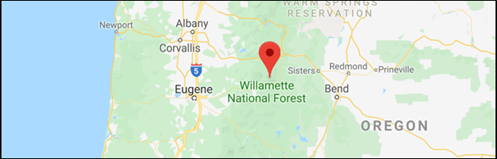

<br>

```{r setup, include=FALSE}
knitr::opts_chunk$set(echo = TRUE)
```

```{r, include=FALSE}
# Attach required packages
library(tidyverse)
library(janitor)
library(here)
library(hrbrthemes)
library(viridis)
library(ggthemes)
library(paletteer)
library(DT)
library(plotly)
library(expss)
library(kableExtra)
library(car)
library(ggbeeswarm)
library(knitr)

```

#### **Introduction**

<br>

Pacific Giant Salamanders (*Dicamptodon tenebrosus*) are a species of amphibian found in western North America. Their range expands southward from southern British Columbia through western Washington and western Oregon, and includes northwest California. [3] Pacific Giant Salamanders are semi-aquatic, occupying cold, freshwater streams and adjacent forest. Population stability is significantly impacted by the quality and quantity of available freshwater. [2] As of August 2015, the IUCN Red List has classified Pacific Giant Salamanders as a species of Least Concern. [3] However this species, like most amphibians, is considered an indicator species. [2] Fluctuations in Pacific Giant Salamander populations may indicate the early signs of habitat degradation. [2] Logging, among other human activities, can negatively impact Pacific Giant Salamander populations. [2] This report analyzes data collected over the course of 23 years (1993-2016) as part of the Aquatic Vertebrate Population Study in Mack Creek Andrews Experimental Forest LTER Site, published by Stanley V. Gregory in 2016. [1] This data was used to quantify and compare Pacific Giant Salamander relative abundance across study sites, and to explore relationships between Pacific Giant Salamander weight and study site location. 

<br>

```{r, echo=FALSE, warning=FALSE, out.width = "100%", fig.cap="***Figure 1.*** Pacific Giant Salamander (*Dicamptodon tenebrosus*) [left] and spatial coverage of the two standard reaches of Mack Creek in the H.J. Andrews Experimental Forest used as survey sites since 1993 [right]. Credit [Oregon Wild](https://oregonwild.org/wildlife/pacific-giant-salamander) and [EDI Data Portal](https://portal.edirepository.org/nis/mapbrowse?scope=knb-lter-and&identifier=4027&revision=12)."}
#Insert salamander and map image with caption


```

<br>
 
#### **Data & Methods**

<br>

Pacific Giant Salamander population size and demographics have been examined in Mack Creek, Oregon since 1993, as part of a larger [aquatic vertebrate population study](https://portal.edirepository.org/nis/mapbrowse?scope=knb-lter-and&identifier=4027&revision=12). [1] Areas of focus (reaches) include a section of clear cut forest (CC) and a 500 year-old conifer old growth forest (OG), located upstream of the CC forest. [1] Each reach is approximately 150 m in length, and blocked every 50 m by nets. [1] Samples are taken every 50 m along each reach using 2-pass electrofishing; length and weight data is recorded for all captured aquatic vertebrates. [1] The total number of Pacific Giant Salamanders counted at Mack Creek was visualized to compare abundance in CC forest to that in OG forest. Included is a table displaying Pacific Giant Salamander counts and proportions by channel classification for both OG and CC forests in the year 2017. Based on these values, a Chi-Square test for independence was used to determine if forest condition has a significant effect on the location within the channel at which Pacific Giant Salamanders are found. Additionally, to determine if there is a significant difference in mean weights between the two forest sections, mean Pacific Giant Salamander weights were compared across forest sections using a Welch’s two-sample t-test (alpha = 0.05). Beeswarm plots and quantile-quantile plots were then used to visualize mean weight distributions across each forest section, revealing an abnormal distribution of means. Knowing this, it would have been more accurate to visualize this data using Box-and-whisker plots, and to perform non-parametric statistical analyses to examine sample medians. This report presents analysis and figures exclusively prepared using .R software version 3.6.1. 

<br>


```{r, echo=FALSE, warning=FALSE, out.width = "100%", fig.cap="***Figure 2.*** Mack Creek is located in the H.J. Andrews Experimental Forest, a Long-Term Ecological Research Site. Credit [GoogleMaps](https://www.google.com/maps/place/Mack+Creek/@44.2331797,-122.1849309,15z/data=!4m5!3m4!1s0x54bf5f54d8de4e19:0xae27a36b0c69a1b8!8m2!3d44.2111833!4d-122.1527863)."}
#Insert salamander and map image with caption

```


<br>

#### **Results**

<br>


```{r, include=FALSE}
# Read in csv titled "mack_creek_vertebrates.csv"

mack_data <- read_csv("mack_creek_vertebrates.csv")

mack_clean <- mack_data %>%
  clean_names()
```

```{r, include=FALSE}
mack_date <- mack_clean %>% 
  mutate(date_new = lubridate::mdy(sampledate)) %>%
  mutate(day_new = lubridate::day(date_new)) %>%
  mutate(month_new = lubridate::month(date_new)) %>%
  dplyr::select(-sampledate) %>%
  filter(species == "DITE") %>%
  filter(unittype == "P" | unittype == "C" | unittype == "SC")
```


```{r, include=FALSE}
# Notes on Effect Size (Cohen) prior to conducting data analysis:
# 1. The effect size is the main finding of a quantitative study. While a P value can inform the reader whether an effect exists, the P value will not reveal the size of the effect. In reporting and interpreting studies, both the substantive significance (effect size) and statistical significance (P value) are essential results to be reported.

# 2. Effect sizes should be reported in a paper's Abstract and Results sections.

# you must determine what number of subjects in the study will be sufficient to ensure (to a particular degree of certainty) that the study has acceptable power to support the null hypothesis. That is, if no difference is found between the groups, then this is a true finding

# 3. The indices fall into two main study categories, those looking at effect sizes between groups and those looking at measures of association between variables (table 1). For two independent groups, effect size can be measured by the standardized difference between two means, or mean (group 1) – mean (group 2) / standard deviation.

# 4. Cohen classified effect sizes as small (d  =  0.2), medium (d  =  0.5), and large (d ≥ 0.8).

# Between group means, the effect size can also be understood as the average percentile distribution of group 1 vs. that of group 2 or the amount of overlap between the distributions of interventions 1 and 2 for the two groups under comparison. For an effect size of 0, the mean of group 2 is at the 50th percentile of group 1, and the distributions overlap completely (100%)—that is , there is no difference. 
```

```{r, include=FALSE}

# Notes on differences in MEANS (ANOVA) prior to conducting data analysis:
# 1. Null Hypothesis (H0): All means are equal (in other words, all groups are from populations with the same mean). Alternative Hypothesis (HA): At least two group means are NOT equal (that means that just two could be different, or they could ALL be different)

# 2. One-Way ANOVA (also called single-factor ANOVA) There is a single factor (variable), with at least 3 levels, where we are trying to compare means across the different levels of that factor.

# Variance test: Levene’s Test (most common). Generally, if the largest sample variance is < 4× the smallest sample variance, the variances are close enough

# 3. Make sure to use a Density/Histogram plot to visually see the differences in variances.

# 4. If the distance between groups is large (high between groups variance) compared to the distance between observations within groups (low within groups variance), then we might have enough evidence to conclude that samples are drawn from populations with different means.

# if you decide that at least two means differ significantly, use the Tukey’s test for Honestly Significant Differences (Tukey’s HSD)

```

```{r include=FALSE}
# Notes on Chi-Squared
# Compare proportions.  Good for "counts"
# Null hypothesis: No association between variables studied. The null hypothesis is independence. Alternative hypothesis: There is an association between variables studied (non-independence). 
# Cells contain frequencies (counts)
# You should do a Chi-Square Test if:
# - Levels are mutually exclusive (an outcome can contribute to only one count)
# - Each subject contributes only one value to dataset (e.g. no longitudinal data with same subjects)
# - Groups are independent (e.g. no paired groups)
# - wo categorical variables
# - Value of the cell expecteds should be 5 or more in at least 80% of the cells, and no cell should have an expected of less than one. This assumption is most likely to be met if the sample size equals at least the number of cells multiplied by 5. 

```

```{r include=FALSE}
# Notes on Two Sample T-Test:
# Two-Sample t-test:

# - To compare means of two samples

# - Null hypothesis: no significant difference (difference in means = 0)

# - t-statistic: based on difference in sample means, sd, n

# - If the difference in means is very unlikely to occur by random chance if samples are drawn from identical populations, then we may decide that they ARE significantly different 

```
**A.** Annual counts of Pacific Giant Salamander were visually compared in OG and CC sections of Mack Creek (1993-2016). Visualizations display the changes in annual counts for each section of Mack Creek over time. From 1993 to approximately 2014, Pacific Giant Salamander counts in OG forest sections of Mack Creek generally exceed counts obtained in CC forest sections. From 2014 to 2016, this trend is reversed. General population growth and decay patterns are similar between both sites, displaying an overall increase in population from 1995 to approximately 2002. This is followed by an overall decline until 2006, a more drastic decline around 2014, and growth from 2014 to 2016. 


```{r echo=FALSE, include=TRUE, warning=FALSE, out.width = "100%", fig.cap="***Figure 3.** Comparison of annual Pacific Giant Salamander counts in OG and CC sections of Mack Creek (1993-2016).*"}
# Results A: Visually compare annual salamander counts in old growth (OG) and clear cut (CC) sections of Mack Creek. For all years when Pacific giant salamander observations were recorded in the study, find the total annual Pacific giant salamander counts for the two sections of Mack Creek. Create a finalized graph to show the changes in annual counts for each section over time, add a figure caption, and briefly describe the trends in text. 

sal_abundance <- mack_date %>%
    dplyr::select(year, section, species) %>%
  group_by(year, section, species) %>%
  tally()

sal_total <- sal_abundance %>%
  group_by(section, species, year) %>%
  summarise(
    total = sum(n)
  )

sal_total_plot <- ggplot(sal_total, aes(x=year, y=total)) +
    geom_line(aes(color=section), size=1.2 ) +
    theme_ipsum() +
    theme(
      legend.position="right",
      plot.title = element_text(size=14)
    ) +
    ggtitle("Total Salamanders Counted at Mack Creek") +
   scale_color_viridis(discrete=TRUE, option="cividis") +
  labs(x = "year",
       y = "salamander count")

sal_total_plot
```

<br>
**B.** Table of 2017 salamander counts by channel classification (pool, cascades and side-channel) in old growth (OG) and clear cut (CC) sections of Mack Creek.

```{r echo=FALSE, include=FALSE, warning=FALSE}
# Results B: Table of 2017 salamander counts by channel classification (pool, cascades and side-channel) in old growth (OG) and clear cut (CC) sections of Mack Creek. Using only Pacific giant salamander observations from 2017, create a finalized table showing the counts and proportions of salamanders observed in different channel classifications (pool, cascade, or side-channel) within Mack Creek for the two sections (OG and CC). Add a table caption above the table. Note: We’re only interested in Pacific giant salamanders observed in the creek, so you should exclude salamanders observed in isolated pools (IP) disconnected from the channel. 

sal_summary <- mack_date %>%
  dplyr::select(unittype, section, year, species) %>%
  filter(unittype == "P" | unittype == "C" | unittype == "SC") %>%
  filter(year == 2017) %>%
  dplyr::select(-year) %>%
  group_by(unittype, section) %>%
  tally()


kable(sal_summary, col.names = c("Channel Classification",
                           "Section",
                           "Total Count")) %>% 
  kable_styling(bootstrap_options = c("striped", "hover"))


```


```{r, include=FALSE}
# Results C: Using the 2017 counts found in Results B above, answer: is there a significant difference in where in the channel Pacific giant salamanders are located (pool, cascade or side channel) between the two sections (old growth and clear cut)? Another way to ask this: Regarding the locations where salamanders were observed in Mack Creek in 2017, is there a significant effect of forest condition (old growth or clear cut) on where in the channel salamanders are found (channel classification)? Report your statistical findings in text, in the context of the actual counts / proportions you present in the table. 

sal_count_date <- mack_date %>%
  dplyr::select(unittype, section, year, date_new) %>%
  filter(unittype == "P" | unittype == "C" | unittype == "SC") %>%
  filter(year == 2017) %>%
  group_by(date_new, unittype, section) %>%
  tally()
  

```


```{r echo=FALSE, include=FALSE, warning=FALSE}

#  fig.cap = "***Figure 1.**Table of 2017 salamander counts by channel classification (pool, cascades and side-channel) in old growth (OG) and clear cut (CC) sections of Mack Creek.*"}
# First, filter then get a table of counts & proportions: 


sal_count_table <- sal_summary %>% 
  pivot_wider(names_from = unittype, values_from = n)
 
sal_count_table
```


```{r echo=FALSE, include=TRUE, warning=FALSE}
sal_adorn <- sal_count_table %>% 
  janitor::adorn_percentages(denominator = "row") %>% 
  adorn_pct_formatting(digits = 0) %>% 
  adorn_ns(position = "front")

kable(sal_adorn, caption = "***Figure 4.** The table below displays Pacific Giant Salamander counts and proportions by channel classification [pool (P), cascades (C), or side-channel (SC)] in 2017.*") %>% 
  kable_styling()

```

```{r, include=FALSE}
#8. Chi-Square test for independence

#Chi-square is a test for associations between two or more nominal (categorical variables), usually comparing counts within groups across levels. 

#What we're really asking: are the proportions within different levels in a group so different *across* multiple groups that we actually think there's an effect of *group*? 

#**Null hypothesis**: There is no significant association between old growth and clear cut sections (or, old growth and clear cut are independent)

#**Alternative hypothesis**: There IS a significant association between old growth and clear cut (or, old growth and clear cut are NOT independent)

# First, get just a contingency table of counts we just want the six count values in a df, nothing else: 

chi_counts <- sal_count_table %>% 
  dplyr::select(-section)

chi_counts

```

```{r, include=FALSE}

# B. Run a chi-square test for independence using `chisq.test()`:

my_channel_chi <- chisq.test(chi_counts)

my_channel_chi

summary(my_channel_chi)

```
<br>

**C.** 2017 Pacific Giant Salamander counts from the table above were used to determine if there is a significant effect of forest condition on where salamanders are found within the channel based on the channel classifications P, C, and SC. A Chi-Square test for independence revealed that there is *not* a significant association between forest condition and the number of salamanders counted within specific channel classifications ($\chi$^2^(`r my_channel_chi$parameter`)) = `r my_channel_chi$statistic` and ($p-value$(`r my_channel_chi$parameter`)) = `r my_channel_chi$p.value`.


```{r, include=FALSE, warning=FALSE}
# Results D. Compare weights of Pacific giant salamanders in clear cut and old growth forest sections of the creek in 2017. Only considering creek section (OG or CC) as a variable (not further factoring by channel classification), answer: Is there a significant difference in mean weights for Pacific giant salamanders observed in the two forest sections (clear cut and old growth) in 2017? 

#Welch two sample ttest for comparing difference in means of clear cut and old growth sections.


#**Null hypothesis**: There is no significant difference in weight mean between old growth and clear cut sections (or, old growth and clear cut weight means not significantly different)

#**Alternative hypothesis**: There IS a significant difference in weight mean between old growth and clear cut (or, old growth and clear cut are significantly differenct)


sal_stats <- mack_date %>% 
  filter(year == 2017) %>%
  group_by(section) %>% 
  summarize(
    mean_weight = mean(weight, na.rm = TRUE),
    sd_weight = sd(weight, na.rm = TRUE),
    sample_size = n(),
    se_weight = sd(weight, na.rm = TRUE) / sqrt(n()),
    var_weight = var(weight, na.rm = TRUE)
  )

sal_stats

kable(sal_stats, col.names = c("Section",
                           "Mean Weight",
                           "SD Weight", "Sample Size",
                           "SE Weight",
                           "Var Weight"),
        caption = 
            "Figure 5. The table below includes the means, standard deviations, and sample weights of Pacific Giant Salamanders foung in CC or OG forest sections in 2017.") %>% 
  kable_styling(bootstrap_options = c("striped", "hover"))


# lRun a two-sample T-Test to see if there is a significant difference in the means of clear cut vs. old growth sections. 

# Question: Are clear cut salamander significantly different in weight than old growth slamanders(using a significance level of 0.05)?

sec_welch <- mack_date %>%
  dplyr::select(section, year, weight, unittype) %>%
  filter(unittype == "P" | unittype == "C" | unittype == "SC") %>%
  filter(year == 2017) %>%
  dplyr::select(-year) %>%
  group_by(weight, section)

cc_sample <- sec_welch %>%
  filter(section == "CC") %>%
  pull(weight)

t.test(cc_sample)

og_sample <- sec_welch %>%
  filter(section == "OG") %>%
  pull(weight)

t.test(og_sample)

section_ttest <- t.test(cc_sample,og_sample)

section_ttest

# A resulting p-value under 0.05 means that variances are not equal and than further parametric tests such as ANOVA are not suited. We should use chi-squared.
```

```{r, include=FALSE, warning=FALSE}
# Run a density plot to visualize if there's a significant difference in means. 

section_density <- sec_welch

sec_affil <- ggplot(section_density, aes(x=weight, group = section)) +
    geom_density(aes(color = section, fill = section), alpha=0.8) +
    ggtitle("Weight of Salamanders at Clear Cut vs. Old Growth Sections") +
  theme_ipsum() +
  scale_color_viridis(discrete = TRUE, option = "cividis", guide = FALSE) +
  scale_fill_viridis(discrete = TRUE, option = "cividis", name = "Section") +
  geom_vline(xintercept = 3.7, color = "darkgrey", size = 0.5, linetype = 2)

sec_affil +
   theme(
    plot.title=element_text( hjust=0.5, vjust=0.5, face='bold')
    )

```

<br>

**D.** A Welch two-sample t-test was used to determine if there is a significant difference in Pacific Giant Salamander mean weights between individuals found in CC or OG forest sections in 2017. Analysis shows that there is *no* significant difference in mean weight of Pacific Giant Salamanders (t(683.21) = 1.4859, p = 0.1378) located in CC forests (7.77587 ± 9.9 g [mean ± sd],  n = 368) and OG forests (6.701818 ± 9.035g [mean ± sd], n = 320).


```{r echo=FALSE, include=TRUE, warning=FALSE, out.width = "100%", fig.cap="***Figure 5.** Observed Pacific Giant Salamander weights in relation to mean Pacific Giant Salamander weights in OG and CC forests sections.*"}
# Results C continued.

sal_weight <- mack_date %>%
  dplyr::select(year, section, weight) %>%
  filter(year == 2017)

sal_weight_plot <- ggplot() +
  geom_beeswarm(data = sal_weight, 
                aes(x = section, 
                    y = weight),
                size = 3,
                alpha = 0.6,
                pch = 16,
                color = "gray70") +
  labs(title = "Mean Weights of Pacific Giant Salamanders (CC & OG Forests)") +
  scale_x_discrete(labels = c("Clear Cut", "Old Growth")) +
  geom_point(data = sal_stats, aes(x = section, y = mean_weight), 
             color = "firebrick",
             size = 4) +
  geom_errorbar(data = sal_stats, 
                aes(x = section, 
                    ymin = mean_weight - sd_weight,
                    ymax = mean_weight + sd_weight),
                color = "firebrick",
                width = 0.1) +
  theme_light()

sal_weight_plot

```

<b/r>

The graph above visualizes Pacific Giant Salamander weights for individuals found in CC and OG forests. The bar heights represent mean Salamander weight for each section. The red error bar indicates how individual observations are dispersed around the mean. It appears that measurements from the OG forest section are slightly more precise than those from the CC forest section.  


```{r echo=FALSE, include=TRUE, warning=FALSE, out.width = "100%", fig.cap="***Figure 6.** This QQ-Plot visualizes the skewed distribution in Pacific Giant Salamander weights in both OG and CC forest sections.*"}
# We need to see if the weight in Salamanders is normally distrubted between the two sections. To do this. We will use a qq plot.

ggplot(data = mack_date, aes(sample = weight)) +
  geom_qq(aes(color = section),
                 alpha = 0.5,
                 show.legend = FALSE
          ) +
  labs(title = "Distribution of Pacific Giant Salamander Weights (OG and CC forests)") +
  facet_wrap(~section, scales = "free") +
  scale_color_viridis(discrete = TRUE, option = "cividis")

# Based on the results of our qq plot, the data is NOT normally distributed.
```

A Quantile-quantile plot was created to determine if Pacific Giant Salamander weight data is normally distributed. Based on the results of this plot, it is evident that the Salamander weight data is *not* normally distributed in either forest section. Therefore, analyzing this data based on mean values likely produced inaccurate outcomes.  To avoid errors due to skewed data, statistical analyses should have focused on median Salamander weights. Using a non-parametric Wilcox Test and visualizing the data through a boxplot would have produced more accurate outcomes. 

```{r echo=FALSE, include=TRUE, warning=FALSE}
weight_channel <- mack_date %>%
  dplyr::select(unittype, weight, year) %>%
  filter(year == 2017) %>%
  filter(unittype == "P" | unittype == "C" | unittype == "SC")

weight_summary <- weight_channel %>%
  filter(year == 2017) %>%
  group_by(unittype) %>% 
  summarize(
    mean_weight = mean(weight, na.rm = TRUE),
    sd_weight = sd(weight, na.rm = TRUE),
    sample_size = n(),
    se_weight = sd(weight, na.rm = TRUE) / sqrt(n()),
    var_weight = var(weight, na.rm = TRUE)
  )

kable(weight_summary, caption = "***Figure 7.** The table below displays the median Pacific Giant Salamander Weights for each channel (P, C, and SC).*") %>% 
  kable_styling()

```


```{r, echo=FALSE, include=TRUE, warning=FALSE, out.width = "100%", fig.cap="***Figure 8.** The beeswarm plot above visualizes the mean Pacific Giant Salamander weights in each of the different channels (P, C, and SC).*"}

#First, visually compare Pacific giant salamander weights between the three channel classifications. You can choose how to best visualize the weights between the three groups (Beeswarm? Jitter? Histogram? Density? Something else?), but you should indicate values for the mean, and standard deviation, standard error or a 95% confidence interval. Add a figure caption. 

channel_weight_plot <- ggplot() +
  geom_beeswarm(data = weight_channel, 
                aes(x = unittype, 
                    y = weight,
                    ),
                size = 3,
                alpha = 0.6,
                pch = 16,
                color = "gray70") +
  scale_x_discrete(labels = c("C", "P", "SC")) +
  geom_point(data = weight_summary, aes(x = unittype, y = mean_weight), 
             color = "firebrick",
             size = 4) +
  geom_errorbar(data = weight_summary, 
                aes(x = unittype, 
                    ymin = mean_weight - sd_weight,
                    ymax = mean_weight + sd_weight),
                color = "firebrick",
                width = 0.1) +
  labs(title = "Mean Pacific Giant Salamander Weights (P, C, and SC Channels)") +
  theme_light()

channel_weight_plot

```

```{r, echo=FALSE, include=FALSE}
channel_aov <- aov(weight ~ unittype, data = weight_channel)
summary(channel_aov)

#We retain the alternative hypothesis (mean weights for the 3 channels are NOT the same). But are they all different from each other? Or just two? 
```


```{r, echo=FALSE, include=FALSE}
# comparing to Type III ANOVA

channel_lm <- lm(weight ~ unittype, data = weight_channel)
channel_aov_t3 <- Anova(channel_lm)
channel_aov_t3

# Now we know about data structure for one-way ANOVAs, but we also need to make sure we satisfy the assumptions:

```

```{r echo=FALSE, include=FALSE}
# Normality
# Samples are independent
# Population variances are equal

# **ANOVA is relatively robust to violations of the normality assumption and the equal variance assumption. No, that doesn’t mean you can just use an ANOVA without looking at your data.

# Variance test: Levene’s Test (most common)

leveneTest(weight ~ unittype, data = weight_channel) # Not significant (we retain the null hypothesis of equal variances)


```

```{r echo=FALSE, include=FALSE}
TukeyHSD(channel_aov)

# Conclusion: means for ALL pairwise combinations are significantly different
```

```{r echo=FALSE, include=FALSE}
# Now I will find just how big of a difference SC-P really have by running a Cohen.d Test.

pool_sample <- weight_channel %>%
  filter(unittype == "P") %>%
  pull(weight)

t.test(pool_sample)

side_sample <- weight_channel %>%
  filter(unittype == "SC") %>%
  pull(weight)

t.test(side_sample)

sc_p_ttest <- t.test(pool_sample, side_sample)

sc_p_ttest

channel_cohen <- effsize::cohen.d(pool_sample, side_sample, na.rm = TRUE)

channel_cohen

summary(channel_cohen)
```

**E.** Mean Pacific Giant Salamander weights did *not* differ significantly between Pool (9.29 +/- 1.56) and Cascades (7.52 +/- 0.43) nor did it differ significantly between the Cascades and the Side Channel (5.68 +/- 0.65).  However, there *is* a significant difference between Salamander weights when comparing individuals found in the Side Channel to those found in Pool channel classifications (one-way ANOVA with post-hoc Tukey's HSD, F(2) = 4.2156, SC-P *p adj* < 0.05). However, after running the difference against a Cohen's d test and receiving a value of approximately 0.352 it can be concluded that the difference in mean Salamander weight between Pool and Side Channel classifications is small.


```{r echo=FALSE, include=TRUE, warning=FALSE, out.width = "100%", fig.cap="***Figure 9.** The above QQ-Plot visualizes the skewed distribution of Pacific Giant Salamander weights in each of the different channels (P, C, and SC).*"}


# We need to see if the weight in Salamanders is normally distrubted between the two sections. To do this. .

ggplot(data = mack_date, aes(sample = weight)) +
  geom_qq(aes(color = unittype),
                 alpha = 0.5,
                 show.legend = FALSE
          ) +
  labs(title = "Distribution of Pacific Giant Salamander Weights (P, C, and SC Channels)") +
  facet_wrap(~unittype, scales = "free") +
  scale_color_viridis(discrete = TRUE, option = "cividis") 

# Based on the results of our qq plot, the data is NOT normally distributed.
```

Again, it is important to note that the mean Pacific Giant Salamander weight measurements are not normally distributed within each sample. Performing statistical analyses using the mean Salamander weight has likely produced skewed test results.  Comparing the median Salamander weights by running non-parametric Wilcox Tests and visualizing the data using boxplots would have provided more accurate outcomes. 


<br>

#### **Summary**

* When visualized, changes in Pacific Giant Salamander counts over time displayed similar trends across OG and CC forest sites in Mack Creek.

* A Chi-Square test for independence revealed that there is *not* a significant association between forest condition and the number of salamanders counted within specific channel classifications.
  
* Measurements of Pacific Giant Salamander weights in OG and CC forests, as well as measurements of Salamander weights in P, C, and SC sites, *did not display normal distributions*.

* Analyses show that there is *no* significant difference in mean weight of Pacific Giant Salamanders between OG and CC sites, nor is there a significant difference in Salamander mean weight across P and C, and C and SC sites. There is a small difference in mean Salamander weight between P and SC sites. 
  
* Mean Pacific Giant Salamander weight measurements are *not* normally distributed within each sample. Performing statistical analyses using median Salamander weights would produce more accurate results.

<br>

#### **References**

[1]Andrews Forest LTER Site and S. V. Gregory, “Aquatic Vertebrate Population Study in Mack Creek, Andrews Experimental Forest, 1987 to present.” Environmental Data Initiative, 2016.

[2]“Pacific Giant Salamander | Oregon Wild.” [Online]. Available: https://oregonwild.org/wildlife/pacific-giant-salamander. [Accessed: 30-Nov-2019].

[3]“The IUCN Red List of Threatened Species,” IUCN Red List of Threatened Species. [Online]. Available: https://www.iucnredlist.org/en. [Accessed: 01-Dec-2019].


